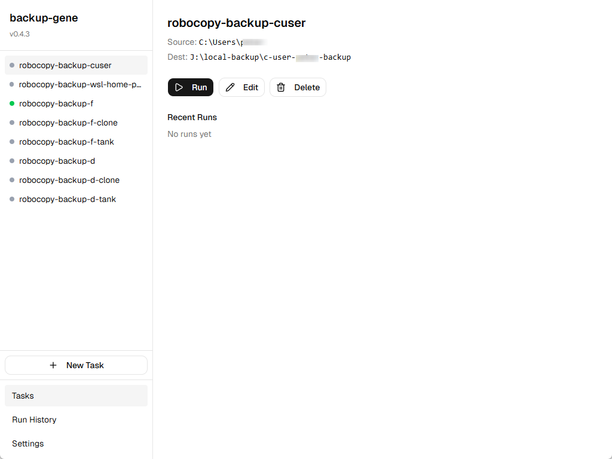
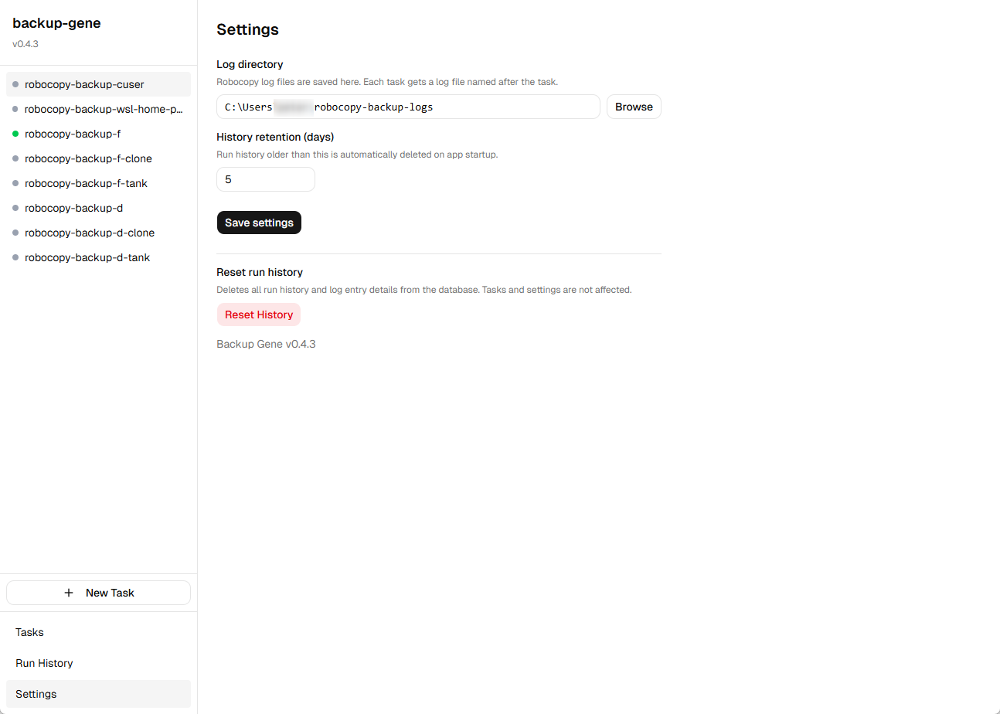

<p align="center">
  
</p>

<h1 align="center">Backup Gene</h1>

<p align="center">
  A modern Windows desktop app for managing <a href="https://learn.microsoft.com/en-us/windows-server/administration/windows-commands/robocopy">robocopy</a> backup tasks.<br>
  Configure, run, and track your backups — no more writing <code>.cmd</code> scripts.
</p>

<p align="center">
  
  
  
</p>

---

## Screenshots

<p align="center">
  <br>
  <em>Task list with sidebar navigation and status indicators</em>
</p>

<p align="center">
  <br>
  <em>Task detail view showing recent run results</em>
</p>

<p align="center">
  <br>
  <em>Task editor with robocopy options and live command preview</em>
</p>

<p align="center">
  <br>
  <em>Run history with filters, expandable stats, and log entries</em>
</p>

<p align="center">
  <br>
  <em>Settings for log directory, history retention, and reset</em>
</p>

## Features

- **Task Management** — Create, edit, and organize backup tasks into groups. Each task defines a source, destination, and robocopy options.
- **Visual Robocopy Configuration** — Toggle flags (`/S`, `/MT`, `/XJ`, etc.), set thread counts, retry policies, and exclusion lists through a clean UI instead of remembering CLI flags.
- **Live Command Preview** — See the exact `robocopy` command that will execute as you configure options.
- **One-Click Execution** — Run a single task or an entire group. Each task spawns in its own console window so you can watch progress in real time.
- **Run History & Statistics** — Every run is recorded with timestamps, exit codes, file/directory/byte counts, and transfer speeds. Filter by task or status.
- **Detailed Log Entries** — Expand any run to see individual files and directories that were copied, skipped, or failed.
- **Smart Status Indicators** — Color-coded dots show each task's last run result at a glance (green = success, yellow = warning, red = error, blue pulsing = running).
- **Native Folder Picker** — Browse for source/destination paths using the system file dialog, including UNC and WSL paths.

## Tech Stack

| Layer | Technology |
|-------|-----------|
| Framework | [Tauri v2](https://v2.tauri.app/) (Rust backend + WebView2 frontend) |
| Frontend | React 19, TypeScript, [shadcn/ui](https://ui.shadcn.com/) |
| Styling | Tailwind CSS v4 |
| Backend | Rust (robocopy process management, log parsing) |
| Config | JSON (`%APPDATA%/backup-gene/config.json`) |
| History | SQLite (`%APPDATA%/backup-gene/backup-gene.db`) |

## Getting Started

### Prerequisites

- **Windows 10/11** (robocopy is a built-in Windows command)
- [Node.js](https://nodejs.org/) (v18+)
- [Rust](https://rustup.rs/) (latest stable)
- [Tauri v2 prerequisites](https://v2.tauri.app/start/prerequisites/)

### Development

```bash
# Clone the repository
git clone https://github.com/petarvucetin/robocopy-tasker.git
cd robocopy-tasker

# Install dependencies
npm install

# Run in development mode (starts both Vite dev server and Tauri window)
npm run tauri dev
```

The app opens at 1024x768. The Vite dev server runs on `http://localhost:1420` with hot reload.

### Production Build

```bash
# Build the distributable installer
npm run tauri build
```

This produces an `.msi` (WiX) and/or `.exe` (NSIS) installer in:

```
src-tauri/target/release/bundle/
```

## Usage

### 1. Create a Backup Task

1. Click **+ New Task** in the sidebar.
2. Fill in a **name**, pick a **group** (or create one), and set the **source** and **destination** paths.
3. Configure robocopy options:
   - **Flags** — `/S` (subdirectories), `/J` (unbuffered I/O), `/XJ` (exclude junctions), `/TEE` (log + console), etc.
   - **Values** — `/MT` (thread count, 1–128), `/R` (retries), `/W` (wait between retries).
   - **Exclusions** — `/XD` (exclude directories) and `/XF` (exclude files) with dynamic add/remove.
4. Review the **command preview** at the bottom to verify the generated robocopy command.
5. Click **Save**.

### 2. Run Backups

- **Single task** — Select a task in the sidebar, then click the **Run** button.
- **Entire group** — Hover over a group header and click **Run Group** to execute all tasks in that group.

Each task launches robocopy in its own **console window** so you can monitor progress directly. The sidebar shows a pulsing blue dot while a task is running.

### 3. View Run History

Switch to the **History** view to see all past runs. You can:

- **Filter** by task name or status (success / warning / error / cancelled).
- **Expand** any row to see detailed statistics (directories, files, bytes, speed) and individual file-level log entries.
- **Clean up** old runs using the "Clear older than" dropdown (30 / 60 / 90 days).

### Understanding Exit Codes

Robocopy uses a bitmask-based exit code system:

| Exit Code | Status | Meaning |
|-----------|--------|---------|
| 0 | Success | No changes needed — everything up to date |
| 1 | Success | One or more files were copied |
| 2–3 | Success | Extra files/dirs detected and/or files copied |
| 4–7 | Warning | Mismatches or mixed results |
| 8+ | Error | Copy failures or fatal errors occurred |

## Project Structure

```
backup-gene/
├── src/                        # React frontend
│   ├── components/
│   │   ├── layout/             #   App shell (sidebar + main area)
│   │   ├── task-list/          #   Task sidebar, detail view, recent runs
│   │   ├── task-editor/        #   Task form, option controls, command preview
│   │   ├── run-history/        #   History table, filters, expandable rows
│   │   ├── log-entries/        #   Detailed file/dir log entries
│   │   ├── settings/           #   Settings view
│   │   └── ui/                 #   shadcn/ui primitives
│   ├── hooks/                  #   React hooks (config, running tasks, runs)
│   └── lib/                    #   Types, Tauri command wrappers, utilities
├── src-tauri/                  # Rust backend
│   ├── src/
│   │   ├── lib.rs              #   Tauri commands & app state
│   │   ├── config.rs           #   JSON config manager
│   │   ├── process.rs          #   Robocopy process spawner
│   │   ├── history.rs          #   SQLite history manager
│   │   ├── log_parser.rs       #   Robocopy log parser
│   │   ├── models.rs           #   Shared data types
│   │   └── validation.rs       #   Path & option validation
│   └── tests/fixtures/         #   Sample robocopy log files
└── docs/                       # Design specs and plans
```

## Configuration

App data is stored in `%APPDATA%/backup-gene/`:

| File | Purpose |
|------|---------|
| `config.json` | Task definitions, groups, and settings (human-editable) |
| `backup-gene.db` | SQLite database with run history and log entries |
| `logs/` | Robocopy log files (one per task run) |

### Settings

- **Log Directory** — Where robocopy log files are stored (default: `%APPDATA%/backup-gene/logs/`).
- **History Retention** — Automatically clean up runs older than a configured number of days.

## License

This project is private and not currently published under an open-source license.
